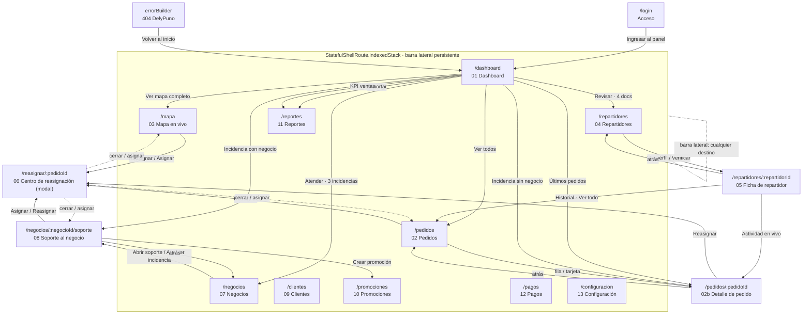

# Navegación · DelyPuno Operaciones

Panel de administración construido sobre `go_router`. Toda la navegación pasa
por las constantes de `lib/core/router/app_routes.dart`; no existe ninguna
cadena literal de ruta en las pantallas.

## Grafo de navegación

Las flechas punteadas desde `/reasignar/:pedidoId` indican que el modal
devuelve el control a la pantalla desde la que se abrió (`context.pop()`), sin
perder su estado.

## Tabla ruta ↔ widget ↔ accesos

| Nº | Ruta | Widget | Tipo | Entradas | Salidas |
|---|---|---|---|---|---|
| — | `/login` | `LoginScreen` | Pantalla completa | Arranque sin sesión · `redirect` | 01 |
| 01 | `/dashboard` | `DashboardScreen` | Rama del shell | Login · barra lateral · 404 | 02, 02b, 03, 04, 07, 08, 11 |
| 02 | `/pedidos` | `PedidosScreen` | Rama del shell | Barra lateral · 01 · 05 | 02b, 06 |
| 02b | `/pedidos/:pedidoId` | `PedidosScreen(pedidoId:)` | Ruta hija (push) | 02 · 01 · 05 · incidencias | 02 (atrás), 06 |
| 03 | `/mapa` | `MapaVivoScreen` | Rama del shell | Barra lateral · 01 | 06 |
| 04 | `/repartidores` | `RepartidoresScreen` | Rama del shell | Barra lateral · 01 · 05 | 05, hoja de registro |
| 05 | `/repartidores/:repartidorId` | `RepartidorDetalleScreen` | Ruta hija (push) | 04 | 04 (atrás), 02, 02b, diálogos |
| 06 | `/reasignar/:pedidoId` | `ReasignacionScreen` | **Modal** sobre el navegador raíz | 02, 02b, 03, 08 | Vuelve al origen |
| 07 | `/negocios` | `NegociosScreen` | Rama del shell | Barra lateral · 01 · 08 | 08, hoja de registro |
| 08 | `/negocios/:negocioId/soporte` | `SoporteNegocioScreen` | Ruta hija (push) | 07 · 01 (incidencias) | 07 (atrás), 06, 10, hojas |
| 09 | `/clientes` | `ClientesScreen` | Rama del shell | Barra lateral | Hoja de ficha de cliente |
| 10 | `/promociones` | `PromocionesScreen` | Rama del shell | Barra lateral · 08 | Publica / guarda borrador |
| 11 | `/reportes` | `ReportesScreen` | Rama del shell | Barra lateral · 01 | Exporta Excel / PDF |
| 12 | `/pagos` | `PagosScreen` | Rama del shell | Barra lateral | Procesa liquidación |
| 13 | `/configuracion` | `ConfiguracionScreen` | Rama del shell | Barra lateral | Hojas de tarifa, rol e invitación |
| — | `errorBuilder` | `NoEncontradoScreen` | Pantalla completa | Cualquier ruta desconocida | 01 |

### Modales, hojas y diálogos (no son pantallas)

| Componente | Se abre desde | Archivo |
|---|---|---|
| Centro de reasignación | 02, 02b, 03, 08 | `features/reasignacion/.../reasignacion_screen.dart` |
| Confirmación (suspender, bloquear, cancelar, forzar cierre, procesar) | 02b, 05, 08, 09, 12 | `core/widgets/app_dialogs.dart` |
| Registrar repartidor | 04 | `features/repartidores/.../hoja_registrar_repartidor.dart` |
| Registrar negocio | 07 | `features/negocios/.../hoja_registrar_negocio.dart` |
| Editar producto · Ajustar horario · Ajustar comisión | 08 | `features/negocios/.../hojas_soporte.dart` |
| Ficha de cliente | 09 | `features/clientes/.../hoja_ficha_cliente.dart` |
| Editar tarifa · Editar rol · Invitar miembro | 13 | `features/configuracion/.../hojas_configuracion.dart` |

## Verificación de alcance

Cada una de las 13 pantallas del diseño tiene **al menos una entrada** y **al
menos una salida**:

- [x] **01 Dashboard** — entra desde el acceso y desde la barra lateral; sale a 02, 03, 04, 07, 08, 11.
- [x] **02 Pedidos** — entra desde la barra lateral, desde «Ver todos» del dashboard y desde el historial de la ficha; sale al detalle y al centro de reasignación.
- [x] **03 Mapa en vivo** — entra desde la barra lateral y desde «Ver mapa completo»; sale al centro de reasignación.
- [x] **04 Repartidores** — entra desde la barra lateral y desde «Revisar» del dashboard; sale a la ficha (05).
- [x] **05 Ficha de repartidor** — entra desde «Ver perfil» y «Verificar» de 04; sale con el botón atrás a 04, al detalle de pedido y al listado de pedidos.
- [x] **06 Centro de reasignación** — entra desde 02, 02b, 03 y 08; sale de vuelta a la pantalla de origen.
- [x] **07 Negocios** — entra desde la barra lateral y desde «Atender» del dashboard; sale a 08.
- [x] **08 Soporte al negocio** — entra desde 07 y desde las incidencias del dashboard; sale con el botón atrás a 07, a 06 y a 10.
- [x] **09 Clientes** — entra desde la barra lateral; sale abriendo la ficha del cliente.
- [x] **10 Promociones** — entra desde la barra lateral y desde «Crear promoción» de 08; sale publicando o guardando el borrador.
- [x] **11 Reportes** — entra desde la barra lateral y desde «Exportar» del dashboard; sale exportando.
- [x] **12 Pagos** — entra desde la barra lateral; sale procesando la liquidación.
- [x] **13 Configuración** — entra desde la barra lateral; sale guardando o descartando.

Comprobaciones adicionales:

- [x] Las 13 están registradas en `app_router.dart`.
- [x] Ninguna ruta declarada apunta a una pantalla inexistente.
- [x] Ninguna pantalla queda huérfana: todas se alcanzan desde el acceso.
- [x] El botón atrás funciona en 02b, 05 y 08 y nunca cierra la app desde una pantalla interna (las ramas del shell son el destino del retroceso).
- [x] La barra lateral conserva el destino activo y el estado de cada rama (`indexedStack`).
- [x] Cualquier ruta desconocida cae en `NoEncontradoScreen`, nunca en la pantalla roja de Flutter.
- [x] Cuando un identificador ya no existe (`/repartidores/rep-99`, `/negocios/neg-99/soporte`), la pantalla muestra el 404 propio con el motivo concreto.

## Comportamiento adaptativo

El diseño es de escritorio (1440×900, barra lateral de 260 px). La app lo
reproduce fielmente por encima de 900 px y se adapta por debajo:

| Ancho | Barra lateral | Tablas | Paneles de detalle |
|---|---|---|---|
| ≥ 900 px | Columna fija de 260 px | Cuadrícula del diseño | En columna lateral (02, 03) |
| < 900 px | `Drawer` con el mismo widget | Tarjetas apiladas con etiquetas | Pantalla completa vía ruta hija |
